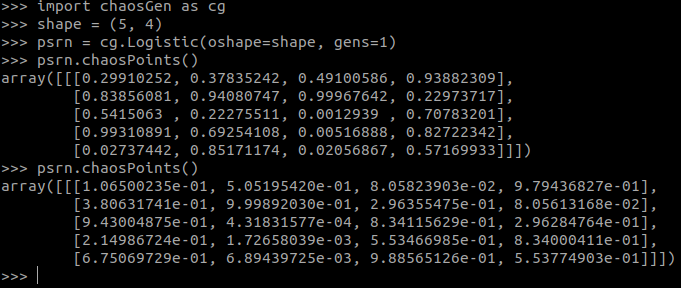
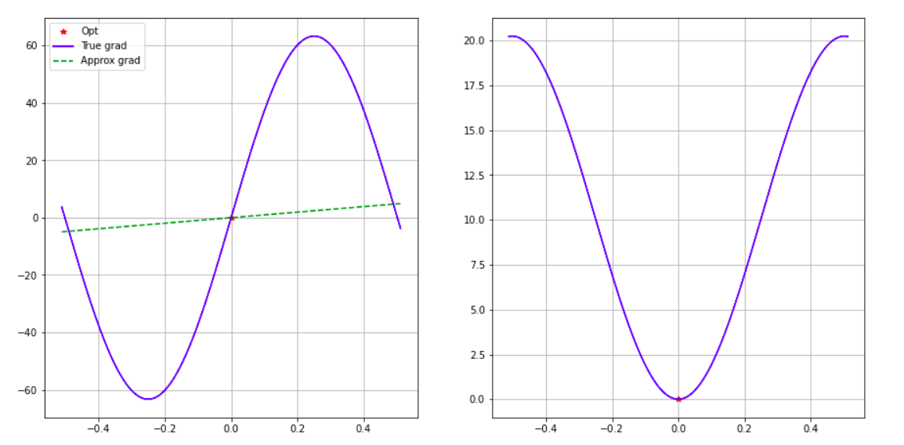
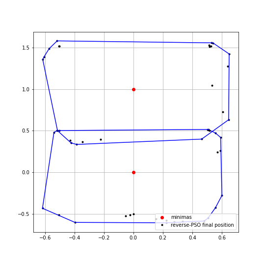

# EMPSO, FCPSO and CRNGs

Contains implementation of [EMPSO](https://arxiv.org/abs/2006.09875) by *Mohapatra et. al*.

Also contains implementation of three variants of [FCPSO](fcpso.py) -
  - FCPSO is [SMPSO](https://ieeexplore.ieee.org/document/4938830) adapted to single-objective problems.
  - FCPSO-em-Beta is SMPSO with exponentially-averaged momentum drawn from a uniform range of the momentum parameter that makes it fairly constricted.
  - FCPSO-em-Omega is also a fairly constricted PSO algorithm, but the momentum parameter distribution is non-uniform

There is also an implementation of Chaotic Random Number Generators (CRNG) in the module [chaosGen.py](chaosGen.py). Below is an example of the CRNG.

The aim of EMPSO is for gradient approximation in neural networks. We have tested EMPSO on simple 1 dimensional objective functions for the accuracy of its gradient. It has worked well on a highly non-linear and multimodal Rastrigin function. Please check [this](Adaswarm.ipynb) notebook for the demo.

This repository also contains the implementation of a novel PSO algorithm named *Reverse-Informed Locally-Searched PSO*. A demo of this PSO variant can be found in [this](RILC-PSO.ipynb) notebook. The special feature of this variant is that it is capable of detecting multiple equally fit global optima. Please refer to the details of which can be found [here](https://www.researchgate.net/publication/344891493_Reverse-Informed_Locally-Searched_PSO).

